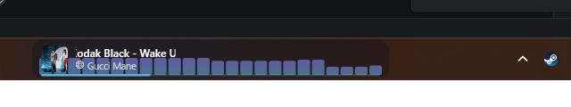

# TaskbarTunes

A now-playing music widget with a live audio visualizer, docked right into the
Windows 11 taskbar. It shows whatever you are listening to — Spotify, YouTube,
any app or website with media — with album art, playback controls and a real
audio spectrum. Everything is customizable.



*Read this in [Español](README.es.md).*

## Highlights

- **Works with anything that plays audio** — no API keys, no logins, no accounts.
  It reads the same global media session Windows itself uses.
- **Real audio visualizer** with **per-process loopback capture**: it reacts to
  your music app only, so games and notifications don't move the bars.
- **Album art driven colors**, 6 visualizer styles, 5 themes and your own presets.
- **Fully local**: zero network connections, zero telemetry. One dependency (NAudio).

## Requirements

- Windows 11, or Windows 10 version 2004 or newer
- [.NET 8 Desktop Runtime](https://dotnet.microsoft.com/download/dotnet/8.0)
  (not needed if you grab the self-contained build from Releases)

## Install

Download the latest `.zip` from [Releases](../../releases), unzip it anywhere and
run `TaskbarTunes.exe`. There is no installer — it's a single portable executable.

On first run SmartScreen will warn you because the executable is not code-signed
(signing requires a paid certificate): **More info → Run anyway**.

Settings live in `%APPDATA%\TaskbarTunes\`. Deleting that folder resets the app.

## Usage

| Action | Result |
|---|---|
| **Single click** | Expanded panel: large album art, full title, seek bar with times |
| **Click the progress bar** | Jump to that point in the song |
| **Drag** | Move the widget along the taskbar (or anywhere on screen in free mode) |
| **Double click** | Configurable action (play/pause by default) |
| **Right click** | Music source, song history (last 50), free overlay mode, Settings, exit |
| **Hover** | Playback controls appear |
| **Tray icon** | Settings, "Start with Windows", exit |

Settings apply live and are saved automatically.

## Customization

- **Appearance** — width, corner radius, position (next to the clock / centered /
  left / custom / free overlay), font family and size, background and text colors
  via a built-in HSV color picker with transparency.
- **Visualizer** — 6 styles (bars, mirrored bars, wave, filled wave, dots, retro
  LEDs), bar count, spacing, opacity, gradient direction, **adaptive color taken
  from the album art** and a **beat mode** that follows the bass only.
- **Content** — toggle album art, artist, controls, progress bar, source icon,
  YouTube title cleanup, and hiding the widget when nothing is playing.
- **Themes** — 5 built-in (Spotify, Neon, Monochrome, Retro amber, Adaptive) plus
  your own presets.
- **Extras** — native Win11 acrylic blur, spinning vinyl album art with crossfade,
  multi-monitor support, and free overlay mode that floats above windowed and
  borderless-fullscreen games.

## How it works

| Piece | Technique |
|---|---|
| Taskbar docking | Borderless WPF window positioned over `Shell_TrayWnd` through Win32; a 500 ms timer re-asserts topmost and follows taskbar auto-hide |
| Track info | `Windows.Media.Control` (GSMTC) for title, artist, album art and transport controls — no web APIs |
| Visualizer | Per-process WASAPI loopback (Windows 10 2004+) → 1024-point FFT with a Hann window → 64 logarithmic bands with auto-gain → ~33 fps render. Switchable to whole-system audio in Settings |

## Build from source

```powershell
git clone https://github.com/ClaudioPenta/TaskbarTunes.git
cd TaskbarTunes
dotnet build
```

Framework-dependent single file:

```powershell
dotnet publish -c Release -r win-x64 --self-contained false /p:PublishSingleFile=true
```

Self-contained single file (~75 MB, no .NET runtime needed on the target machine):

```powershell
dotnet publish -c Release -r win-x64 --self-contained true `
  /p:PublishSingleFile=true /p:EnableCompressionInSingleFile=true `
  /p:IncludeNativeLibrariesForSelfExtract=true
```

## Known limitations

- Album art from YouTube depends on the thumbnail the browser reports.
- With Firefox the source may be classified as "Other" (its app id does not
  contain "firefox"): music still shows, but title cleanup is skipped and the
  visualizer falls back to whole-system audio.
- If the taskbar is set to auto-hide, the widget hides and reappears with it.
- Free overlay mode draws over windowed and borderless-fullscreen games; Windows
  does not allow drawing over *exclusive* fullscreen.
- The progress bar needs the app to report track duration (Spotify does; in a
  browser it depends on the site).

## License

[GPL-3.0](LICENSE) — you are free to use, study, modify and share it, and any
derivative work must stay open under the same license.
